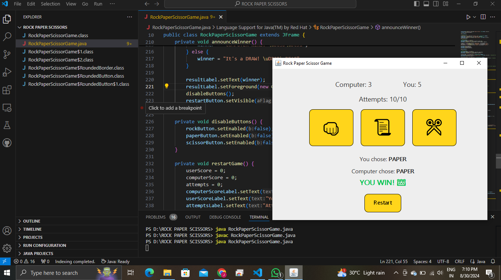

# Rock Paper Scissors Game ✂️🗞️👊🏽

A fun and interactive Rock Paper Scissors game built using Java Swing. Play against the computer and keep track of your scores and attempts with a stylish GUI.

## Features

- **Interactive GUI**: Custom-designed curved input fields and buttons.
- **Score Tracking**: Displays scores for both the player and the computer.
- **Attempts Limit**: Play up to 10 rounds.
- **Restart Option**: Start a new game after reaching the attempt limit.
- **Stylish Design**: Bold and color-coded results with rounded buttons.

## How to Play

1. **Run the Program**: Launch the application to start the game.
2. **Choose Your Weapon**: Click one of the buttons - "Rock", "Paper", or "Scissors".
3. **View Results**: See your choice, the computer’s choice, and the round result.
4. **Check Scores**: Keep track of your score and the computer's score.
5. **Restart**: Click the "Restart" button to play again after reaching the attempt limit.

## Screenshots


## How to Run

1. **Compile the Program**:

    ```bash
    javac RockPaperScissorGame.java
    ```

2. **Run the Program**:

    ```bash
    java RockPaperScissorGame
    ```

## Custom Components

- **CurvedButton**: JButton with curved edges and a yellow fill.
- **RoundedBorder**: Custom border with rounded corners for a stylish look.

## Dependencies

- Java (JDK 8 or later)

## Contributing

Feel free to fork this repository, create a feature branch, and submit a pull request. Contributions are welcome!
